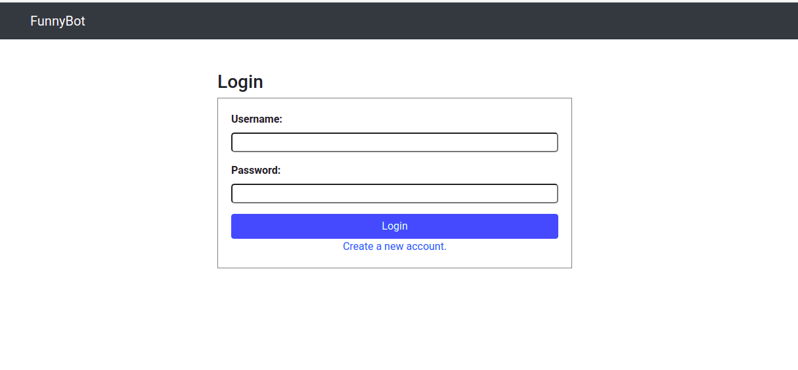

# ChatBot
## Funny BOt
This is a coding assignment project wriiten in Python/Django

## Features
- Registration

- Login

- User can choose joke any options  ` fat, dumb, stupid `
- After clicking on button user will get funny response through websocket.

- There is an Options of Audit page, where user can see button clicked audits.

## Installation

Requirement ` Python 3.6 , pip & PostgreSql`

` pip install -r requirements.txt `
` create database funny_bot`
configure database in `settings.py` file

DATABASES = {
     'default': {
        'ENGINE': 'django.db.backends.postgresql',
        'NAME': 'funny_bot',
        'USER': '<user>',
        'PASSWORD': '<password>',
        'HOST': 'localhost',
        'PORT': '5432'
    }
}

` python manage.py migrate `
` python manage.py runserver `
` Create new user & then Login `
